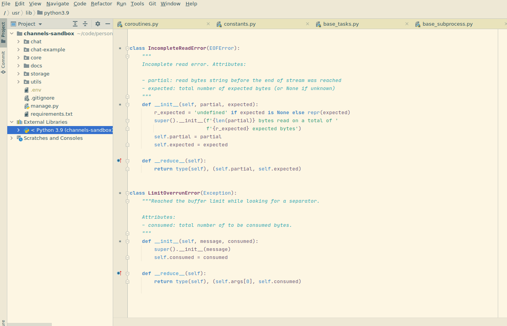

# Pycharm Spacemacs Light Colorscheme

## About

This is a very basic attempt to make Spacemacs light theme for PyCharm.  

Please, note: it's neither full nor complete.

## Based on:
1. Spacemacs Light theme (https://github.com/nashamri/spacemacs-theme) written by Nasser Alshammari.
2. Solarize Themes for the JetBrains IntelliJ Platform (https://github.com/4lex4/intellij-platform-solarized) written by 4lex4

## Screenshots

## Installation
1. Open PyCharm
2. Install "Solarized Themes" plugin.
3. Activate "Solarized Light" theme in `File` -> `Settings` -> `Appearance & Behavior` -> `Appearance`.
4. Import [pycharm-spacemacs-light-colorscheme.icls](./pycharm-spacemacs-light-colorscheme.icls) file in `File` -> `Settings` -> `Editor` -> `Color Scheme` -> `(Gear)` -> `Import Scheme`
